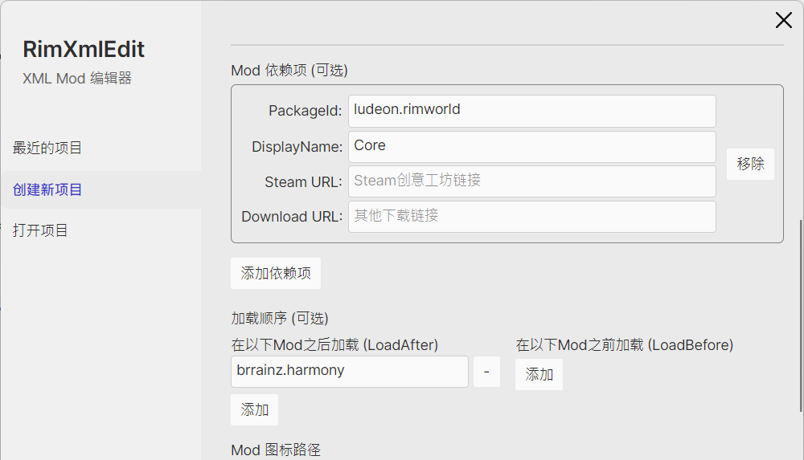
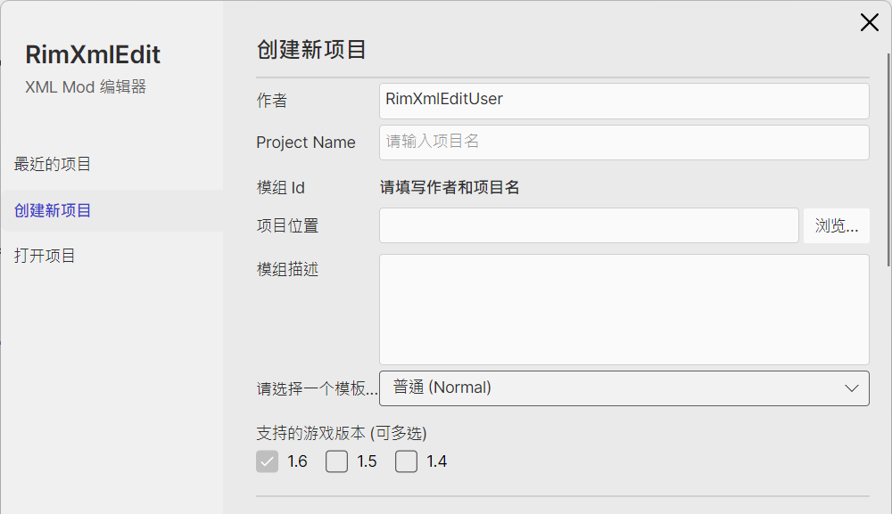
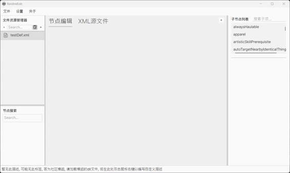

<div align=center>
	
</div>

> 让 XML 编辑变得像填空一样简单！  
> Make XML editing as simple as filling in the blanks!

**RimXmlEdit** 是一款专为《边缘世界 (RimWorld)》Mod 制作设计的可视化编辑工具。无论你是刚刚入门的新手，还是经验丰富的 Modder，这款工具都能通过可视化的节点操作、智能提示和自动解析功能，显著减少工作量并降低出错率。

---

## ✨ 核心特性 (Features)

*   **🛠️ 更简单的项目创建**
    *   内置向导，填写 Mod 名称、ID、作者等信息即可一键创建项目。
    *   支持选择游戏版本（1.4, 1.5, 1.6 等）。
    *   自动生成标准的 `About.xml` 文件。

*   **🧠 强大的 DLL 自动解析**
    *   启动时自动解析官方游戏 DLL。
    *   **支持 Mod 依赖**：如“外星人框架 (Alien Race)”，只需填入对应版本的 DLL 路径，即可在编辑器中加载其特有的 Def 定义。
    *   目前已覆盖绝大多数官方 `Def` 定义（约 255 个）。

*   **👀 可视化节点编辑**
    *   **节点树视图**：左侧列表选择/搜索节点，右侧属性面板进行编辑。
    *   **智能补全**：根据现有的定义或预制模板生成对应节点，内容可直接编辑。
    *   **快捷查询**：绑定快捷键 `Q`，选中节点后按下即可查询并添加当前节点下可用的子节点（Sub-nodes）。

*   **🔄 实时双向同步**
    *   支持 **可视化视图** 与 **XML 源码视图** 实时切换。
    *   修改一端，另一端自动同步更新，方便习惯手写代码的用户进行微调。

*   **🛡️ 数据验证与预览**
    *   底部栏显示简短的属性介绍/文档。
    *   支持简单值验证，对已知类型进行输入检查，并自动修正类型格式。
        *   注意：部分包装过的类型可以当作枚举使用，但界面上仍会显示为子节点。

---

## 🚀 快速开始 (Getting Started)

### 1. 创建新项目
打开软件，在主界面点击“新建项目”。输入你的 `Project Name`、`Mod ID` 及其他描述信息，选择目标游戏版本，软件将自动创建`About.xml`与相关文件夹目录。

|  |   |
| ---- | ---- |
|  ||
### 2. 导入依赖 (可选)

如果你的 Mod 依赖于其他框架（如 Humanoid Alien Races），可以在设置中填入对应 Mod 的 DLL 路径。RimXmlEdit 会自动解析并缓存这些定义。

### 3. 编辑

进入编辑器后，在左侧文件列表选择或新建 `.xml` 文件。
*   **添加节点**：在左侧搜索节点, 鼠标双击右键导入。
*   **编辑属性**：在中间的节点编辑区进行填空修改(根节点如ThingDef无法添加, 加入子节点自动清空)。
*   **查看源码**：随时点击切换到“XML 源文件”查看生成的代码。
*   **节点解释编辑**：若没有当前选择节点注释, 或要修改当前注释, 请双击下方描述区域编辑, 完成后 `Enter` 保存。
*   **保存文档**：支持自动保存(可在设置中修改), 切换文档时保存, 快捷键 `Ctrl+S` 保存。



---

## ⌨️ 快捷键 (Shortcuts)

| 按键 | 功能 |
| :--- | :--- |
| **Q** | 选中节点后，查询并添加该节点下可用的子节点 |
| **Ctrl + S** | 手动保存当前文档 |
---

## 📅 开发计划 (Roadmap)

| 功能                               | 状态     | 备注                          |
| ---------------------------------- | -------- | ----------------------------- |
| 基础可视化编辑与 XML 同步          | ✅ 已完成 |                               |
| 官方 DLL 及部分第三方 Mod DLL 解析 | ✅ 已完成 |                               |
| `About.xml` 自动生成               | ✅ 已完成 |                               |
| mod翻译提取                        | ✅ 已完成 | UI还未施工...                 |
| 增加节点文件模板                   | ✅ 已完成 | UI还未施工...                 |
| 节点描述                           | ❌未完成  | 支持AI自动生成, UI还未施工... |
| 多语言支持                         | ❌未完成  |                               |
| AI生成节点                         | ❌未完成  |                               |

目前本人精力有限, UI部分无法及时更新

## 🤝 贡献与反馈 (Feedback)

如果你在使用过程中遇到 Bug 或有功能建议，欢迎提交 [Issue](https://github.com/Westrmon/RimXmlEdit/issues) 或加 QQ群[958664998](https://qm.qq.com/q/Qj3DFQ9JsG)反馈。

我们欢迎社区贡献！在提交 PR 前请确保：
1. 代码遵循项目现有的编码规范
2. 添加适当的测试用例
3. 更新相关文档

### 开发环境搭建

   ```bash
   git clone https://github.com/Westrmon/RimXmlEdit
   cd RimXmlEdit
   dotnet restore
   dotnet run
   ```

## 声明

### 代码许可证
本软件使用 [GNU Affero General Public License v3.0 only](https://spdx.org/licenses/AGPL-3.0-only.html) 开源

### Logo 使用

本项目的 Logo 是基于《边缘世界 (RimWorld)》官方图标的修改版本。

### 商标声明

RimWorld® 是 Ludeon Studios Inc. 的注册商标。本项目与 Ludeon Studios 没有官方关联。

---

**如果觉得软件对你有帮助，请帮忙点个 Star 吧！~**
